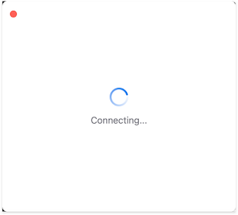

[](https://github.com/Jinxiansen/QuickZoom)
[](https://swift.org)
[](https://developer.apple.com/xcode)
[](https://developer.apple.com/macOS)
[](https://opensource.org/licenses/MIT)

As [Zoom](https://zoom.us) becomes more and more popular, in our daily work, there may be many scenes where Zoom multi-person meetings are used every day. But every time you have to copy the Zoom account and password from the email, sometimes because the password contains spaces, it will cause you to be unable to join the meeting.

[QuickZoom](https://github.com/Jinxiansen/QuickZoom) can help you quickly join the Zoom meeting, reducing the tedious copy and paste, and the probability of errors when copying.

When you copy the Zoom link, you automatically join the meeting.


## Requirements

- macOS 14.0


## Installation

You can choose any of the following installation methods to install.

- Github Release Page
	- Please visit the [Github Release](https://github.com/Jinxiansen/QuickZoom/releases) page to download this app.
	- Then on the Lastest Release page, click the **QuickZoom.zip** file to download.
	- After the download is complete, unzip the zip file and **drag** `QuickZoom` into `Applications`, or use the terminal, enter the directory where QuickZoom is located, and execute **mv QuickZoom.app /Applications/**  


- Use Xcode to compile the source code
	- You can download the source code on this page, and then use Xcode to open the **QuickZoom.xcodeproj** file to run this application.

After the installation is successful, you will see this Q icon in the top menu bar.


## How To Use

Before using this tool, please make sure you have installed the macOS version of the [Zoom app](https://zoom.us).

After you have successfully installed Zoom and QuickZoom, you can try to copy your meeting link to see what happens!
For example, when you copy the following link:

``` shell
case 1
Meeting ID: 959 1701 1534
Passcode: 744594240

case 2
https://xxx.zoom.com.cn/j/3211233218?pwd=jaYeQt-YmAITGr0D3MRTsTm6M531L2vT

case 3
https://xxx.zoom.com.cn/j/3759079899 (Passcode: 682782330)

Select the meeting ID and password, and then press Command + C to copy.

```
>  The above meeting ID and password are no longer valid, and the format is for reference only.

You will see the following interface, and then wait a moment to enter the meeting.




## Feedback

**QuickZoom** is a small tool written on a whim. From the idea to the design of the icon and the completion of the code, it took nearly a day.

Although the code is only a few hundred lines, it helped me solve the trouble of manually filling in every time I join a meeting.

If you encounter problems in use, you can tell me in the following ways:

[Github issue](https://github.com/Jinxiansen/QuickZoom/issues/new) | [Email](mailto:hi@jinxiansen.com)


## 📄 License	

QuickZoom is released under the [MIT license](LICENSE). See LICENSE for details.


